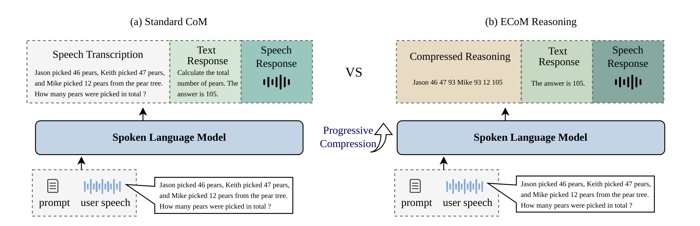

# Efficient Chain-of-Modality Reasoning via Progressive Compression for Spoken Language Models

<p align="center">
  <strong>Pengchao Feng, Chao-Hong Tan, Qian Chen, Wen Wang, Xiangang Li, Xie Chen</strong>
</p>

<p align="center">
  <a href="https://arxiv.org/abs/2607.19932v1"></a>
  <a href="https://github.com/FunAudioLLM/FunResearch/tree/main/ECoM-Reasoning"></a>
  <a href="https://funaudiollm.github.io/FunResearch/ECoM-Reasoning/"></a>
</p>

<p align="center">
  
</p>

We propose **Efficient Chain-of-Modality Reasoning (ECoM Reasoning)**, the first framework to introduce compressed reasoning into spoken language models (SLMs). By compressing the textual component so that it jointly serves as speech guidance and reasoning representation, ECoM Reasoning improves reasoning accuracy while using a smaller token budget than the standard Chain-of-Modality (CoM) architecture, which generates intermediate text before speech. To train this capability, we further propose **Progressive Compression**, a curriculum-based strategy that gradually trains the model from full-form reasoning to compressed reasoning.


## Install

If you are using this project inside **FunResearch**, enter the project directory first:

```bash
cd ECoM-Reasoning
```

If you want to clone only this project from **FunResearch**, use sparse checkout:

```bash
git clone --filter=blob:none --sparse https://github.com/FunAudioLLM/FunResearch.git
cd FunResearch
git sparse-checkout set ECoM-Reasoning
cd ECoM-Reasoning
```

Then initialise the external dependencies directly:

```bash
git clone https://github.com/X-LANCE/SLAM-LLM.git SLAM-LLM
mkdir -p third_party
git clone https://github.com/microsoft/LLMLingua.git third_party/LLMLingua
```

Then set up the environment:

```bash
conda create -n ecom python=3.11 -y && conda activate ecom
pip install -e SLAM-LLM             # the slam_llm framework + core deps
pip install -r requirements.txt

# patched LLMLingua (needed by the data-construction script)
git -C third_party/LLMLingua apply ../../patches/llmlingua-dynamiccache.patch
pip install -e third_party/LLMLingua
```

`SLAM-LLM/` and `third_party/LLMLingua/` are external dependencies; if their remotes are unreachable,
initialise those directories from your own checkouts.

## Run

Run everything **from the repo root** with the framework on the path:

```bash
export PYTHONPATH=./SLAM-LLM/src:$PYTHONPATH
```

1. Put model weights under `checkpoints/` — see [`checkpoints/README.md`](checkpoints/README.md).
2. Build the compressed data and point the manifests — see [`data/README.md`](data/README.md).
3. Edit the paths at the top of each script, then launch:

```bash
bash src/scripts/finetune_com.sh     # train
bash src/scripts/inference_com.sh    # inference (streaming CosyVoice decoding)
```

## Acknowledgements

- [SLAM-LLM](https://github.com/X-LANCE/SLAM-LLM.git) — base speech-LLM framework (`slam_llm`).
- [LLMLingua](https://github.com/microsoft/LLMLingua) — prompt compression for efficient reasoning traces.
- CosyVoice — speech tokenizer / vocoder used for codec decoding.
